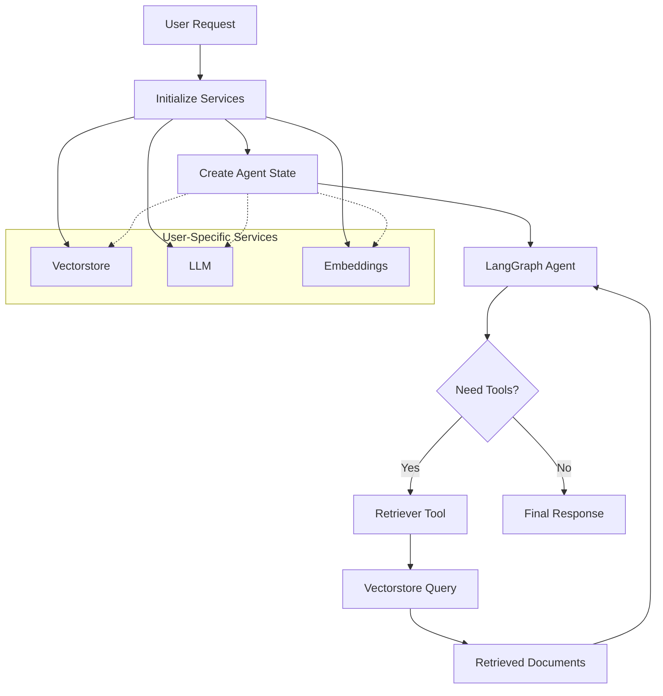

# LangGraph Agent with Retriever Tool

This implementation demonstrates how to create a LangGraph agent that uses a retriever tool to fetch content from a vectorstore, where the vectorstore and other services are initialized based on user choice and passed through the agent state.

## Architecture Overview



## Key Components

### 1. Agent State (`src/core/state/agent_state.py`)

The `AgentState` TypedDict defines the state structure that flows through the agent graph:

- **User Context**: `session_id`, `user_id`, `service_id`, `api_key_id`
- **LLM Configuration**: `temperature`, `max_tokens`, `streaming`
- **Messages**: Conversation history using LangChain's message types
- **Services**: User-specific `vectorstore`, `llm`, `embeddings` instances
- **Retrieved Data**: `retrieved_docs` for storing retrieval results

### 2. Retriever Tool (`src/core/tools/retriever_tool.py`)

The retriever tool uses `InjectedState` to access the vectorstore from the agent state:

```python
@tool
async def retriever_tool(
    query: str, 
    state: Annotated[dict[str, Any], InjectedState]
) -> str:
    vectorstore = state.get("vectorstore")
    docs = await vectorstore.asimilarity_search(query, k=5)
    # Format and return results
```

**Key Features:**
- Accesses vectorstore from injected state
- Performs async similarity search
- Formats retrieved documents with metadata
- Stores results in state for reference
- Handles errors gracefully

### 3. Agent Graph (`src/core/agent.py`)

The LangGraph agent implementation includes:

- **Agent Node**: Processes messages and decides on tool usage
- **Tool Node**: Executes the retriever tool
- **Conditional Routing**: Routes between agent and tools based on tool calls

```python
workflow = StateGraph(AgentState)
workflow.add_node("agent", agent_node)
workflow.add_node("tools", tool_node)
workflow.add_conditional_edges("agent", should_continue)
workflow.add_edge("tools", "agent")
```

## Usage Examples

### Basic Usage

```python
from src.core.agent import run_agent
from src.core.container import ServiceContainer
from src.core.settings import get_settings

# Initialize services
settings = get_settings()
container = ServiceContainer(settings)

# Get services (with default/test API keys)
llm = container.get_llm()
embeddings = container.get_embeddings()
vectorstore = container.get_vector_store(embeddings=embeddings)

# Run the agent
result = await run_agent(
    query="What is LangGraph?",
    vectorstore=vectorstore,
    llm=llm,
    embeddings=embeddings,
    session_id="session_123",
    user_id="user_456"
)

# Get the response
final_message = result["messages"][-1]
print(final_message.content)
```

### User-Specific Services (Production)

```python
# Fetch user's API key from database
user_api_key = fetch_user_api_key_from_db(user_id)

# Create user-specific services
llm = container.get_llm(api_key=user_api_key)
embeddings = container.get_embeddings(api_key=user_api_key)
vectorstore = container.get_vector_store(embeddings=embeddings)

# Run agent with user's services
result = await run_agent(
    query="Your question here",
    vectorstore=vectorstore,
    llm=llm,
    embeddings=embeddings,
    session_id=session_id,
    user_id=user_id,
    temperature=0.8,
    max_tokens=2000
)
```

### Streaming Output

```python
from src.core.agent import run_agent_streaming

async for state_update in run_agent_streaming(
    query="Explain LangGraph",
    vectorstore=vectorstore,
    llm=llm,
    session_id="session_123",
    user_id="user_456"
):
    print(state_update)
```

### Multi-Turn Conversation

```python
from src.core.agent import create_agent_graph
from langchain_core.messages import HumanMessage

# Create agent graph
agent_graph = create_agent_graph()

# Initialize state with services
state = {
    "messages": [HumanMessage(content="First question")],
    "vectorstore": vectorstore,
    "llm": llm,
    "embeddings": embeddings,
    # ... other state fields
}

# First turn
state = await agent_graph.ainvoke(state)

# Second turn (with context)
state["messages"].append(HumanMessage(content="Follow-up question"))
state = await agent_graph.ainvoke(state)
```

## How It Works

### 1. State Initialization

Services are initialized based on user choice and passed into the initial state:

```python
initial_state: AgentState = {
    "messages": [HumanMessage(content=query)],
    "vectorstore": vectorstore,  # User-specific
    "llm": llm,                  # User-specific
    "embeddings": embeddings,    # User-specific
    # ... other fields
}
```

### 2. Agent Execution Flow

1. **Agent Node**: 
   - Retrieves LLM from state
   - Binds tools to LLM
   - Processes messages
   - Decides whether to call tools

2. **Tool Node** (if needed):
   - Executes retriever tool
   - Tool accesses vectorstore from injected state
   - Retrieves relevant documents
   - Returns formatted results

3. **Agent Node** (again):
   - Receives tool results
   - Generates final response
   - Updates state with response

### 3. State Injection

The `InjectedState` annotation allows tools to access the full agent state:

```python
state: Annotated[dict[str, Any], InjectedState]
```

This enables the retriever tool to access user-specific services without them being passed as explicit parameters.

## Benefits of This Approach

1. **User-Specific Services**: Each user can have their own vectorstore, LLM, and embeddings based on their API keys and preferences

2. **Flexible Configuration**: Services are initialized outside the agent and passed through state, allowing easy customization

3. **State Management**: All context (messages, services, retrieved docs) flows through a single state object

4. **Tool Reusability**: Tools can access any service from state using `InjectedState`

5. **Separation of Concerns**: Service initialization is separate from agent logic

## Integration with FastAPI

To integrate with your FastAPI application:

```python
from fastapi import APIRouter, Depends
from src.core.agent import run_agent
from src.core.container import ServiceContainer

router = APIRouter()

@router.post("/chat")
async def chat_endpoint(
    query: str,
    user_id: str,
    session_id: str,
    container: ServiceContainer = Depends(get_container)
):
    # Fetch user's API key from database
    user_api_key = await fetch_user_api_key(user_id)
    
    # Initialize user-specific services
    llm = container.get_llm(api_key=user_api_key)
    embeddings = container.get_embeddings(api_key=user_api_key)
    vectorstore = container.get_vector_store(embeddings=embeddings)
    
    # Run agent
    result = await run_agent(
        query=query,
        vectorstore=vectorstore,
        llm=llm,
        embeddings=embeddings,
        session_id=session_id,
        user_id=user_id
    )
    
    return {
        "response": result["messages"][-1].content,
        "retrieved_docs": result.get("retrieved_docs", [])
    }
```

## Files Created/Modified

1. **`src/core/state/agent_state.py`**: Extended state to include services and messages
2. **`src/core/tools/retriever_tool.py`**: Implemented retriever tool with state injection
3. **`src/core/agent.py`**: Created LangGraph agent implementation
4. **`examples/agent_example.py`**: Comprehensive usage examples

## Running the Examples

```bash
# Navigate to backend directory
cd backend

# Run the examples
python -m examples.agent_example
```

## Dependencies

Make sure you have the following packages installed:

```bash
pip install langgraph langchain langchain-core
```

## Next Steps

1. **Add More Tools**: Create additional tools (web search, scraping) that also use injected state
2. **Implement Checkpointing**: Use LangGraph's checkpointing for conversation persistence
3. **Add Memory**: Integrate conversation memory for context retention
4. **Streaming Support**: Enhance streaming for real-time responses
5. **Error Handling**: Add comprehensive error handling and retry logic

## References

- [LangGraph Documentation](https://langchain-ai.github.io/langgraph/)
- [LangChain Tools](https://python.langchain.com/docs/modules/agents/tools/)
- [State Management in LangGraph](https://langchain-ai.github.io/langgraph/concepts/low_level/#state)
